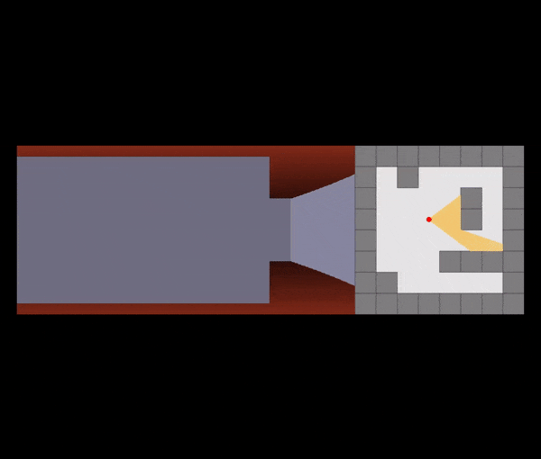

# A simple raycast demo written in pure JS
In this demo, I tried to implement the animation provided on [Wikipedia](https://en.wikipedia.org/wiki/Ray_casting).

[See it in action](https://raycast.netlify.app/)